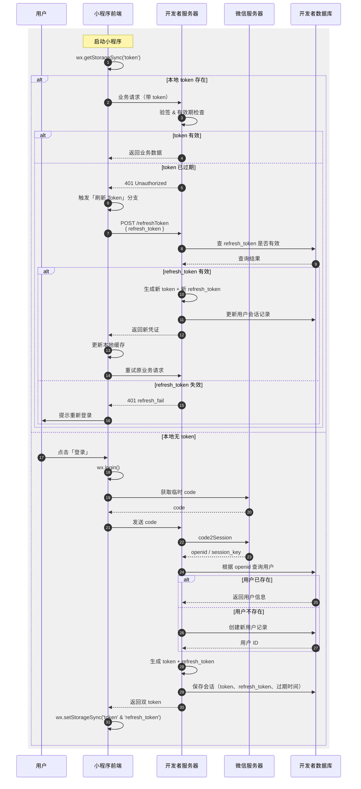

# 这是登录流程

# 微信小程序登录凭证鉴权流程图（含本地缓存 & 刷新 Token 分支）

```mermaid
%% 微信小程序登录凭证鉴权流程（含本地缓存 & 刷新 Token & 开发者数据库）
sequenceDiagram
    autonumber
    participant 用户
    participant 小程序前端
    participant 开发者服务器
    participant 微信服务器
    participant 开发者数据库

    rect rgb(240, 240, 240)
        note over 小程序前端: 启动小程序
        小程序前端 ->> 小程序前端: wx.getStorageSync('token')
        alt 本地 token 存在
            小程序前端 ->> 开发者服务器: 业务请求（带 token）
            开发者服务器 ->> 开发者服务器: 验签 & 有效期检查
            alt token 有效
                开发者服务器 -->> 小程序前端: 返回业务数据
            else token 已过期
                开发者服务器 -->> 小程序前端: 401 Unauthorized
                小程序前端 ->> 小程序前端: 触发「刷新 Token」分支
                小程序前端 ->> 开发者服务器: POST /refreshToken<br/>{ refresh_token }
                开发者服务器 ->> 开发者数据库: 查 refresh_token 是否有效
                开发者数据库 -->> 开发者服务器: 查询结果
                alt refresh_token 有效
                    开发者服务器 ->> 开发者服务器: 生成新 token + 新 refresh_token
                    开发者服务器 ->> 开发者数据库: 更新用户会话记录
                    开发者服务器 -->> 小程序前端: 返回新凭证
                    小程序前端 ->> 小程序前端: 更新本地缓存
                    小程序前端 ->> 开发者服务器: 重试原业务请求
                else refresh_token 失效
                    开发者服务器 -->> 小程序前端: 401 refresh_fail
                    小程序前端 ->> 用户: 提示重新登录
                end
            end
        else 本地无 token
            用户 ->> 小程序前端: 点击「登录」
            小程序前端 ->> 小程序前端: wx.login()
            小程序前端 ->> 微信服务器: 获取临时 code
            微信服务器 -->> 小程序前端: code
            小程序前端 ->> 开发者服务器: 发送 code
            开发者服务器 ->> 微信服务器: code2Session
            微信服务器 -->> 开发者服务器: openid / session_key
            开发者服务器 ->> 开发者数据库: 根据 openid 查询用户
            alt 用户已存在
                开发者数据库 -->> 开发者服务器: 返回用户信息
            else 用户不存在
                开发者服务器 ->> 开发者数据库: 创建新用户记录
                开发者数据库 -->> 开发者服务器: 用户 ID
            end
            开发者服务器 ->> 开发者服务器: 生成 token + refresh_token
            开发者服务器 ->> 开发者数据库: 保存会话（token、refresh_token、过期时间）
            开发者服务器 -->> 小程序前端: 返回双 token
            小程序前端 ->> 小程序前端: wx.setStorageSync('token' & 'refresh_token')
        end
    end

    %% 后续任意业务请求都可复用上方「带 token 请求」逻辑
```
