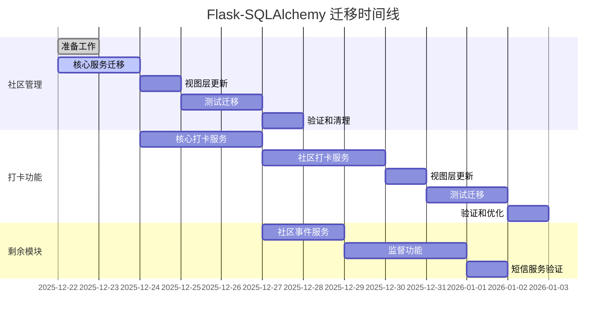

# Flask-SQLAlchemy 迁移总体规划

## 项目背景
SafeGuard 后端项目正在进行从纯 SQLAlchemy 到 Flask-SQLAlchemy 的架构迁移，以简化数据库操作、提升代码可维护性和系统稳定性。

## 迁移状态
### ✅ 已完成
- **UserService** - 用户服务核心模块
- **User 模型** - Flask-SQLAlchemy 版本
- **相关测试** - 29个单元测试全部通过

### 📋 计划中
1. **社区管理模块** (6天)
   - CommunityService
   - CommunityStaffService
   - 相关视图和测试

2. **打卡功能模块** (9天)
   - CheckinRuleService
   - CheckinRecordService
   - CommunityCheckinRuleService
   - UserCheckinRuleService

3. **剩余模块** (5天)
   - CommunityEventService
   - 监督功能
   - SMSService

## 迁移路线图

## 关键里程碑

### Phase 1: 社区管理迁移 (2025-12-22 ~ 2025-12-28)
- **目标**：完成社区相关服务的迁移
- **关键交付**：
  - CommunityService 和 CommunityStaffService 适配 Flask-SQLAlchemy
  - 所有社区管理 API 正常工作
  - 社区相关测试通过

### Phase 2: 打卡功能迁移 (2025-12-24 ~ 2025-01-03)
- **目标**：完成复杂的打卡规则和记录系统迁移
- **关键交付**：
  - 所有打卡相关服务迁移
  - 规则聚合逻辑正常工作
  - 打卡性能不降低

### Phase 3: 剩余模块迁移 (2025-12-26 ~ 2025-12-31)
- **目标**：完成所有剩余模块迁移
- **关键交付**：
  - 社区事件功能正常
  - 监督功能完整迁移
  - 短信服务验证完成

## 技术策略

### 1. 渐进式迁移
- 一次迁移一个模块
- 保持系统持续可用
- 每个模块独立验证

### 2. 向后兼容
- 保留旧服务文件作为备份
- API 接口保持不变
- 数据库结构不变

### 3. 测试驱动
- 先更新测试框架
- 每个迁移伴随测试更新
- 确保功能不退化

## 风险管理

### 高风险项
1. **打卡规则聚合逻辑**
   - 多数据源整合
   - 复杂查询优化
   
2. **监督功能重构**
   - 视图层业务逻辑迁移
   - 事务完整性

### 缓解措施
1. **分阶段验证**
   - 每个功能独立测试
   - 性能基准对比
   
2. **回滚计划**
   - 保留旧代码备份
   - 快速回滚机制

## 资源需求

### 人力资源
- **主开发**：1人，全职
- **代码审查**：0.5人，兼职

### 时间资源
- **总工期**：20个工作日
- **缓冲时间**：3个工作日

## 成功标准

### 功能标准
- [ ] 所有 API 功能正常
- [ ] 单元测试覆盖率 >80%
- [ ] 集成测试全部通过

### 性能标准
- [ ] 响应时间不增加
- [ ] 数据库连接数优化
- [ ] 内存使用稳定

### 质量标准
- [ ] 代码复杂度降低
- [ ] 维护性提升
- [ ] 文档完整更新

## 迁移后收益

### 短期收益
1. **代码简化**
   - 减少80%的会话管理代码
   - 统一数据库操作方式

2. **维护性提升**
   - 减少bug数量
   - 提高开发效率

### 长期收益
1. **架构优化**
   - 更清晰的分层架构
   - 更好的扩展性

2. **团队效率**
   - 新人上手更快
   - 减少培训成本

## 后续优化计划

1. **性能优化**
   - 查询优化
   - 缓存策略
   - 批量操作优化

2. **架构优化**
   - 服务层重构
   - 领域驱动设计
   - 微服务拆分准备

3. **监控增强**
   - 性能监控
   - 错误追踪
   - 业务指标

## 总结

Flask-SQLAlchemy 迁移是 SafeGuard 项目的重要技术升级，将显著提升代码质量和系统稳定性。通过分阶段、有计划的迁移，我们可以在保证系统稳定的同时，完成技术架构的现代化改造。

总工期预计20个工作日，分为三个主要阶段，每个阶段都有明确的目标和交付物。迁移完成后，系统将具备更好的可维护性、扩展性和性能表现。