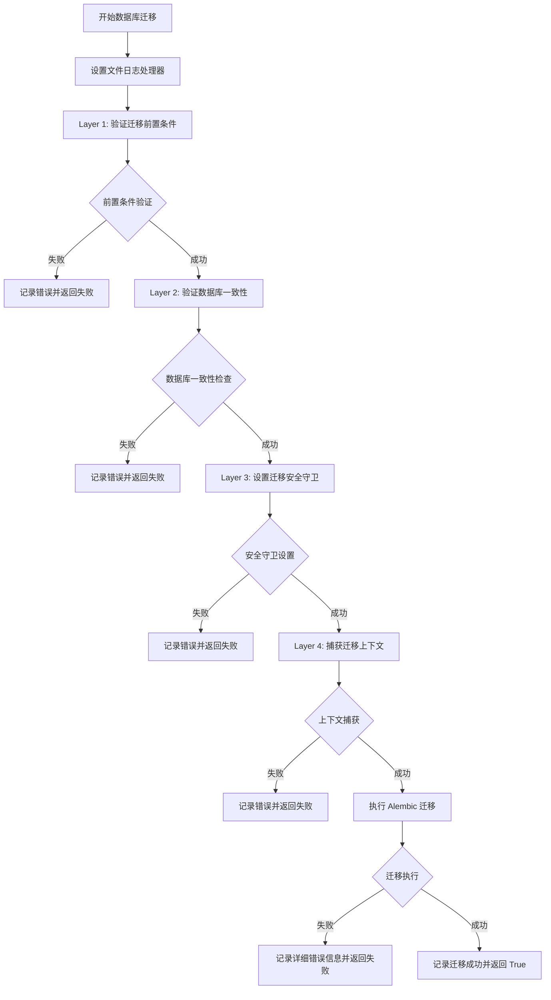
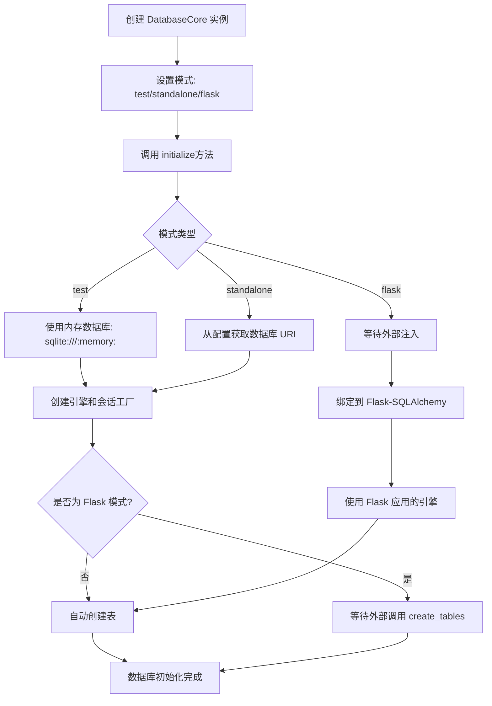
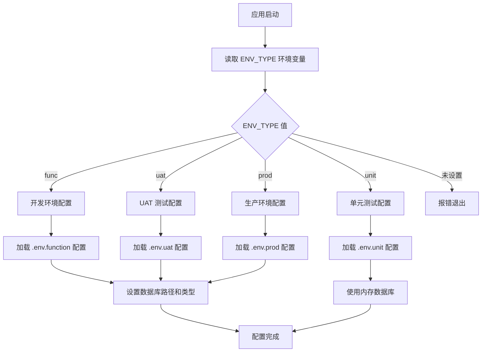
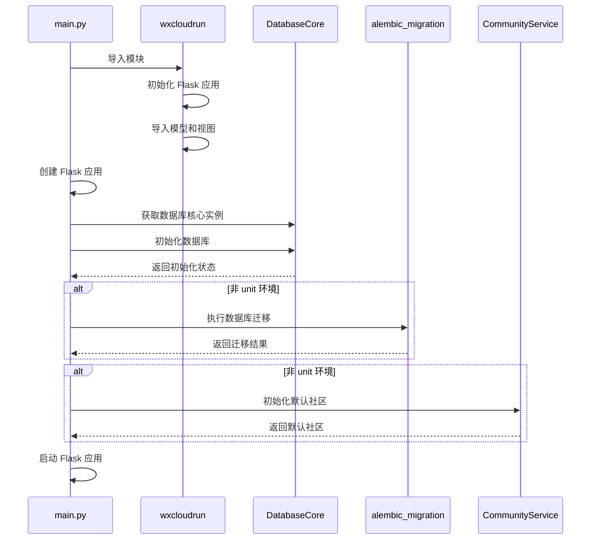
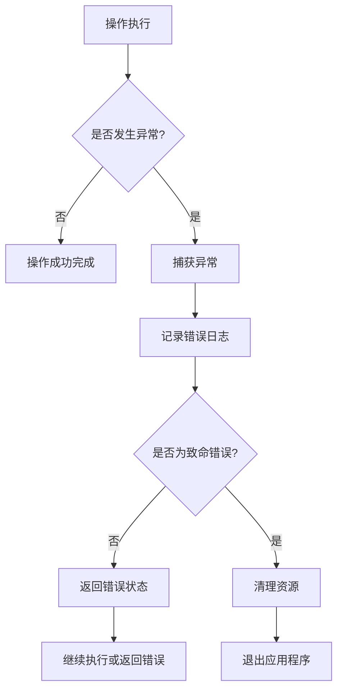

# SafeGuard 后端启动流程图

## main.py 启动流程

```mermaid
flowchart TD
    A[开始执行 main.py] --> B[设置 Python 路径]
    B --> C[配置迁移日志系统]
    C --> D[检查 ENV_TYPE 环境变量]

    D --> E{ENV_TYPE 是否设置?}
    E -->|否| F[输出错误信息并退出]
    E -->|是| G[导入 wxcloudrun 模块]

    G --> H[执行 main- 函数]
    H --> I[创建 Flask 应用实例]
    I --> J[初始化数据库并绑定到 Flask]

    J --> K[获取数据库核心实例]
    K --> L[初始化数据库核心]
    L --> M[将 db_core 保存到 app 中]

    M --> N{当前环境是 unit?}
    N -->|是| O[跳过数据库迁移]
    N -->|否| P[执行数据库迁移]

    P --> Q{迁移成功?}
    Q -->|否| R[记录错误并退出]
    Q -->|是| S[初始化默认社区]

    S --> S1[调用 CommunityService.get_or_create_default_community]
    S1 --> S2{默认社区是否存在?}
    S2 -->|是| S3[返回现有社区]
    S2 -->|否| S4[确保超级管理员存在]

    S4 --> S5[调用 _ensure_super_admin_exists]
    S5 --> S6{超级管理员是否存在?}
    S6 -->|是| S7[返回现有管理员]
    S6 -->|否| S8[创建超级管理员]

    S8 --> S9[设置管理员信息<br/>- 昵称: 系统超级管理员<br/>-角色:4 (super_admin)<br/>- 手机号: 18676790191<br/>- 密码: Firefox0820]
    S9 --> S10[记录审计日志]
    S10 --> S11[提交到数据库]

    S7 --> S12[创建默认社区]
    S11 --> S12
    S12 --> S13[设置社区信息<br/>- 名称: 安卡大家庭<br/>- 描述: 系统默认社区<br/>- 创建者: 超级管理员]
    S13 --> S14[将超级管理员设为社区主管]
    S14 --> S15[记录审计日志]
    S15 --> S16[提交到数据库]

    S3 --> T[启动 Flask 应用]
    S16 --> T

    T --> U[获取 host 和 port 参数]
    U --> V[运行 Flask 应用]
    V --> W[应用启动完成]
```

## wxcloudrun/**init**.py 初始化流程

```mermaid
flowchart TD
    A[导入 wxcloudrun 模块] --> B[添加父目录到路径]
    B --> C[导入 config 和 config_manager]
    C --> D[配置日志系统]
    D --> E[初始化 Flask 应用实例]

    E --> F[设置调试模式]
    F --> G[获取数据库配置]
    G --> H[导入数据库模型]
    H --> I[导入视图模块注册路由]

    I --> J{当前环境是 unit?}
    J -->|是| K[初始化默认社区]
    J -->|否| L[跳过默认社区初始化]

    K --> K1[调用 CommunityService.get_or_create_default_community]
    K1 --> K2{默认社区是否存在?}
    K2 -->|是| K3[返回现有社区]
    K2 -->|否| K4[确保超级管理员存在]

    K4 --> K5[调用 _ensure_super_admin_exists]
    K5 --> K6{超级管理员是否存在?}
    K6 -->|是| K7[返回现有管理员]
    K6 -->|否| K8[创建超级管理员]

    K8 --> K9[设置管理员信息<br/>- 昵称: 系统超级管理员<br/>- 角色: 4 (super_admin)<br/>- 手机号: 18676790191<br/>- 密码: Firefox0820]
    K9 --> K10[记录审计日志]
    K10 --> K11[提交到数据库]

    K7 --> K12[创建默认社区]
    K11 --> K12
    K12 --> K13[设置社区信息<br/>- 名称: 安卡大家庭<br/>- 描述: 系统默认社区<br/>- 创建者: 超级管理员]
    K13 --> K14[将超级管理员设为社区主管]
    K14 --> K15[记录审计日志]
    K15 --> K16[提交到数据库]

    K3 --> M[加载应用配置]
    K16 --> M
    L --> M
    M --> N[启动后台 missing 检查服务]
    N --> O[模块初始化完成]
```

## 数据库迁移流程 (alembic_migration.py)



## 数据库核心初始化流程 (database/core.py)



## 环境配置流程



## 关键组件交互图



## 错误处理流程



## 超级管理员和默认社区创建详细流程

```mermaid
flowchart TD
    A[应用启动时初始化] --> B[调用 CommunityService.get_or_create_default_community]
    B --> C[查询默认社区: 安卡大家庭]

    C --> D{社区是否存在?}
    D -->|是| E[返回现有社区]
    D -->|否| F[开始创建流程]

    F --> G[调用 _ensure_super_admin_exists]
    G --> H[标准化管理员手机号: 18676790191]
    H --> I[计算 phone_hash]
    I --> J[查询超级管理员]

    J --> K{管理员是否存在?}
    K -->|是| L[返回现有管理员]
    K -->|否| M[创建超级管理员]

    M --> N[生成密码 salt]
    N --> O[计算 password_hash<br/>密码: Firefox0820]
    O --> P[创建 User 实例<br/>- wechat_openid: admin_18676790191<br/>- nickname: 系统超级管理员<br/>- role: 4 (super_admin)<br/>- status: 1<br/>- verification_status: 2]
    P --> Q[添加到数据库会话]
    Q --> R[创建审计日志]
    R --> S[提交到数据库]

    L --> T[创建默认社区]
    S --> T
    T --> U[设置社区属性<br/>- name: 安卡大家庭<br/>- description: 系统默认社区<br/>- creator_user_id: 超级管理员ID<br/>- is_default: true]
    U --> V[添加到数据库会话]
    V --> W[创建 CommunityStaff 关系<br/>- 角色: manager (主管)<br/>- 用户: 超级管理员]
    W --> X[创建审计日志]
    X --> Y[提交到数据库]
    Y --> Z[初始化完成]

    E --> Z
```

### 超级管理员账户信息

-   **手机号**: 18676790191
-   **密码**: Firefox0820
-   **昵称**: 系统超级管理员
-   **角色**: 4 (super_admin)
-   **微信 OpenID**: admin_18676790191
-   **状态**: 启用 (status=1)
-   **验证状态**: 已通过验证 (verification_status=2)

### 默认社区信息

-   **名称**: 安卡大家庭
-   **描述**: 系统默认社区，新注册用户自动加入
-   **创建者**: 超级管理员
-   **类型**: 默认社区 (is_default=true)
-   **设置**:
    -   最大用户数: 10000
    -   自动审批: false

### 创建时机

1. **非 unit 环境**：在 main.py 中，数据库迁移成功后创建
2. **unit 环境**：在 wxcloudrun/**init**.py 中直接创建（使用内存数据库）

### 安全机制

1. **密码哈希**: 使用 SHA256 + salt 存储密码
2. **手机号哈希**: 使用 SHA256 + secret 存储手机号
3. **审计日志**: 记录所有创建操作
4. **事务管理**: 使用数据库事务确保数据一致性

## 说明

1. **启动顺序**：main.py 是应用的入口点，负责整体启动流程的控制
2. **环境检查**：首先检查 ENV_TYPE 环境变量，确保应用在正确的环境中运行
3. **数据库初始化**：根据环境类型选择不同的数据库配置和初始化策略
4. **迁移管理**：使用 Alembic 进行数据库版本管理，支持多层次的验证和安全检查
5. **模块化设计**：各组件职责清晰，通过依赖注入实现解耦
6. **错误处理**：完善的错误处理机制，确保应用异常时的优雅退出
7. **超级管理员**：系统自动创建具有最高权限的管理员账户，负责社区管理
8. **默认社区**：所有新用户自动加入的默认社区，确保系统基础功能正常运行
